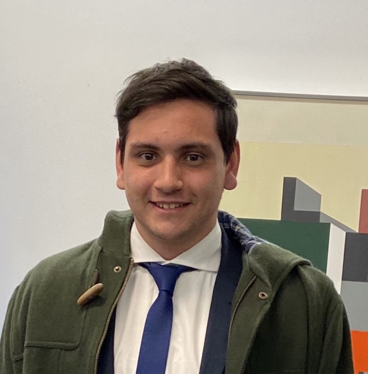

# VisionUTN-FRC 
 Clases de Visión por Computadora en UTN-FRC 

# Alumno 

 

elemento {
}
.about-the-author img {
    float: left;
    max-width: 100px;
    border: 1px solid rgba(0, 0, 0, 0.3);
    border-radius: 100%;
    margin: 0 1rem 1rem 0;

Matias Dogliani   (72152)

## Requisitos                                                               
                                                                                
* Python3                                                                       
* OpenCV                                                                        
* Entorno virtual (no necesario)                                                

